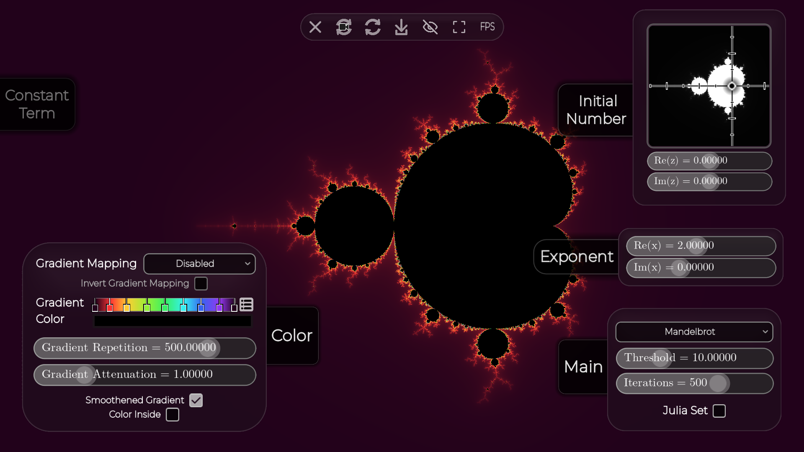
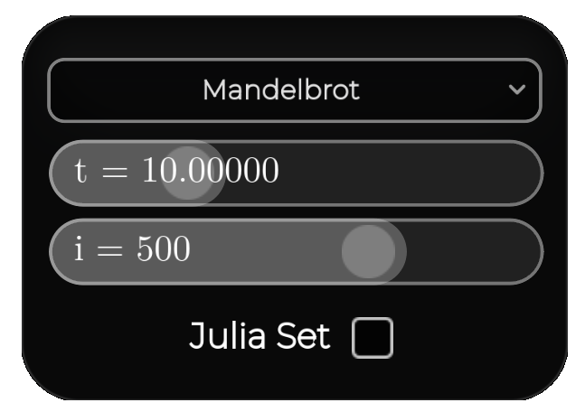

# **FRACTALS EXPLORER**
#### GitHub repo: https://github.com/ADOGamedev/Fractals

#### Description: an app made in Godot 4.6 which allows you to control EVERY aspect of some complex-recursive fractals like the Mandelbrot Set.

## **How to use it**

#### **YOU ARE ENCOURAGED TO MESS AROUND WITH EVERY CONTROL AN SEE WHAT IS DOES**

I wanted to keep the design minimalist, but that makes it more difficult to know how to control it. So this is an in-depth explation:

### **Sliders**
The main things you are going to touch are probably the sliders.
Depending on what use a slider has, it can just allow integer values, all real values in some range, or just all real values. 
In this last case, the slider will let you continue dragging indefinitely, although visually it may have reached the end.
Also, it can have **exponential edit** which gives more precision for low values and less for big ones.

> [!IMPORTANT]
> You may want more control over the slider, to do this there are 4 levels of control:  
> - **Drag with Left Click**: the basic one, to move the slider around without much precision.
> - **Drag with Left Click + Shift**: this gives 10 times more control, allowing for finer adjusting.
> - **Drag with Left Click + Ctrl**: like the previous one but with 1000 times more control instead.
> - **Drag with Left Click + Shift + Ctrl**: like the previous one but with 10000 times more control instead. 

### **Main panel**:
Located at the bottom-right corner, it allows you to select 4 different things.

#### The first option allows you to select what type of fractal you want. There are three options, each with different recursive formulas:
 **Mandelbrot**: $z_{n+1} = z_n^x + c$   
 **Burning ship**: $z_{n+1} = (|Re(z_n)| + i|Im(z_n)|)^2 + c$  
 **Rings Fractal**: ${\Large z_{n+1} = \frac{z_n^2(z_n^2 + c)e^{2\pi\phi i}}{c z_n^2 + 1}}$

 where $z_n$ is each term of the sucesion, $c$ si a complex number, $x$ is a chosen complex number and $\phi = \frac{1 + \sqrt{5}}{2}$.

> [!NOTE]
> This formulas are adapted to allow full control over each thing.
#### Next, there is the **threshold** $t$. To understand what this does, we have to first know how rendering a fractal works:

First we take an initial number $z_0$, apply the corresponding recursive formula, per example: $z_1 = z_0^2 + c$. This new value $z_1$ is then fed in again to the formula giving $z_2 = z_1^2 + c$ and we continue this process again and again. If this number continues growing, it is not part of the set. To do this, the program checks if the current $z_n$ is greater than some threshold $t$. The default value for $t$ is 10, which works great with all the fractals.

#### Just below the threshold there is the **iterations** slider $i$, this is related to how the program calculates the fractal, just like the previous one:

Apart from seeing if the number reaches a threshold, it can get in a loop, never reaching the threshold, these are the points that belong to the set. To solve this, theres is a limit on how many times the recursive formula can be fed into it self. This limit is the iteration count $i$

> [!NOTE]
> Greater iteration count will give you a more accurate fractal but may lag your computer. In the other hand, lower values will make the fractal less detailed.

#### Finally, the **Julia Set** option, to know what this does we have to see how the $c$ and $z_0$ values are chosen:

When **Julia Set** is off, the initial $z$ value ($z_0$) is chosen manually, these are the default values:
- **Mandelbrot**: $z_0 = 0$
- **Burning Ship**: $z_0 = 0$
- **Rings Fractal**: $z_0 = 1$

The $c$ instead is chosen depending on the pixel of the image that is being rendered. When we render the pixel at, say, $1 + 0.5i$, the $c$ value used to perform the calculations during the rendering of that pixel will be $1 + 0.5i$.

In the other case, when **Julia Set** is on, the $c$ value is chosen manually, the defaults being:
- **Mandelbrot**: $c = -0.76133 + 0.07694i$
- **Burning Ship**: $c = -0.4384 + 0.07305i$
- **Rings Fractal**: $c = \sqrt{2}$

> [!NOTE]
> These default values have been chosesd for aesthetic reasions.

And this time, $z_0$ is chosen based on the pixel that is being rendered.