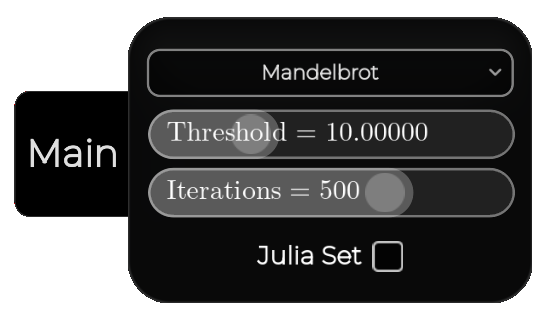
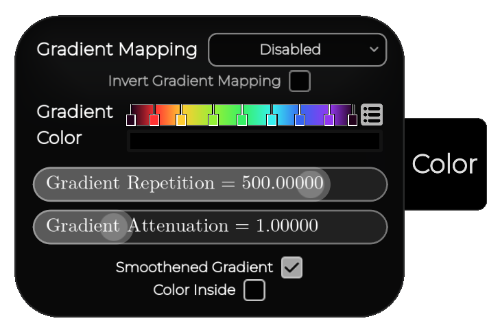

# **FRACTALS EXPLORER**
#### GitHub repo: https://github.com/ADOGamedev/Fractals

#### Description: an app made in Godot 4.6 which allows you to control EVERY aspect of some complex recursive fractals like the Mandelbrot Set, or self-contained fractals like Sierpinski's N-Flakes, also in 3D (like Mandelbulb or Sierpinski Polyhedra)!.

## **How to use it**

#### **YOU ARE ENCOURAGED TO MESS AROUND WITH EVERY CONTROL AND SEE WHAT IT DOES**

### **Sliders**
The main things you are probably going to touch are the sliders.
Depending on what a slider is used for, it can only allow integer values, all real values in some range, or just all real values. 
In this last case, the slider will let you continue dragging indefinitely, although visually it may have reached the end.
Also, it can have **exponential editing**, which gives more precision for low values and less for big ones.

> [!IMPORTANT]
> You may want more control over the slider. To do this, there are 4 levels of control:  
> - **Drag with Left Click**: the basic one, to move the slider around without much precision.
> - **Drag with Left Click + Shift**: this gives 10 times more control, allowing for finer adjustments.
> - **Drag with Left Click + Ctrl**: like the previous one but with 1000 times more control instead.
> - **Drag with Left Click + Shift + Ctrl**: like the previous one but with 10000 times more control instead. 

> [!IMPORTANT]
> If you want to reset a slider to its default value, double-click it.

### **Gradient Selector**
This is another important one, found in every fractal under the **Color** panel.
The gradient selector works just like Godot's built-in one.
There are little color selectors which you can **Left Click** to change the color. If you **Right Click** on any of them, you'll delete it (you must always have at least 2 color selectors).
If you **Left Click** on an empty part of the gradient, you'll add a new color selector.

Lastly, there are some presets which you can select by clicking the little menu button at the right of the gradient selector.

### **Main menu**
When you open the app, you'll be able to select the fractal.

### **Utilities Bar**
After selecting a fractal, a bar will show up at the top, this is what each thing does:
- **Close Fractal**: goes back to the main menu (you can also press the ESC key).
- **Reset Camera**: resets the camera to its default zoom and position.
- **Reset Fractal**: completly reloads the fractal (just like exiting and re-entering a fractal)
- **Save Fractal Image**: download your creations in any size up to 22K (21840 x 12285 px).
    1. Select the resolution in the drop-down menu.
    2. Name your fractal.
    3. Select the file extension (.png, .jpg, .mbp, .tif, .webp).
    4. Select the folder in which the image will be saved.
    5. Click save!

    > [!NOTE]
    > When saving in large resolutions it may take some time to finish
    > If you have an exiting file with the same name and extension, it will ask if you want to override it.
- **Hide UI**: well, in other word, makes the UI invisible.
    > [!IMPORTANT]
    > Press F1 to show it again after hidding it.
- **Toggle Fulscreen**: yep, preety self-explanatory.
- **Show/Hide FPS**: toggles the visibility of an FPS indicator at the right of the utilities bar.
- **Show/Hide Manual**: toggles the visibility of a manual with all the controls.

> [!WARNING]
> This will just explain how to use the app, so it's assumed you have a basic understanding of fractals.
> It's not essential to use the app, though.

## **COMPLEX FRACTALS 2D**

### **Main panel**:
Located in the bottom-right corner, it allows you to select 4 different things.

#### The first option allows you to select what type of fractal you want. There are three options, each with different recursive formulas:

**Mandelbrot**: $z_{n+1} = z_n^x + c$   

**Burning ship**: $z_{n+1} = (|Re(z_n)| + i|Im(z_n)|)^x + c$  

**Rings Fractal**: ${\Large z_{n+1} = \frac{z_n^x(z_n^x + c)e^{2\pi\phi i}}{c z_n^x + 1}}$

where $z_n$ is each term of the sequence, $c$ is a complex number, $x$ is a chosen complex number and $\phi = \frac{1 + \sqrt{5}}{2}$.

> [!NOTE]
> These formulas are adapted to allow full control over each parameter.

#### Next, there is the **threshold** slider.
This is the number that the code checks to determine if a point is inside the set. In Mandelbrot,
it is proven that the fractal is contained inside a circle of radius 2, so the threshold should be 2.
However, its default value is 10, as it works well for all fractals and gives better-looking images.

#### Just below the threshold there is the **iterations** slider.

This is the limit on how many times the fractal recursive formula can be applied.

> [!NOTE]
> A greater iteration count will give you a more accurate fractal but may slow down your computer. On the other hand, lower values will make the fractal less detailed.

#### Finally, the **Julia Set** option. To know what this does, we have to see how the $\text{Constant Term}$ and $\text{Initial Value}$ values are chosen (which I'll call $c$ and $z$ respectively):

When **Julia Set** is off, the initial $z$ value ($z_0$) is chosen manually. These are the default values:

- **Mandelbrot**: $z_0 = 0$
- **Burning Ship**: $z_0 = 0$
- **Rings Fractal**: $z_0 = 1$

The $c$ value instead is chosen depending on the pixel of the image that is being rendered. When we render the pixel at, say, $1 + 0.5i$, the $c$ value used to perform the calculations during the rendering of that pixel will be $1 + 0.5i$.

In the other case, when **Julia Set** is on, the $c$ value is chosen manually, with the following defaults:

- **Mandelbrot**: $c = -0.76133 + 0.07694i$
- **Burning Ship**: $c = -0.4384 + 0.07305i$
- **Rings Fractal**: $c = \sqrt{2}$

> [!NOTE]
> These default values have been chosen for aesthetic reasons.

And this time, $z_0$ is chosen based on the pixel that is being rendered.

### **Color Panel**

This is probably the most complex panel, but it allows you to give your fractals a wide variety of looks. I'll explain how it works:

Before anything, we have to clarify one thing: "Gradient Mapping" refers to the **mathematical** meaning of gradient (the direction of steepest increase). In other contexts, I refer to a **Color Gradient**.

#### The gradient mapping option allows you to select different colorings based on the gradient. These are the options:

- **HSB**: assigns the **angle** of the gradient vector to the HUE of the color and the **magnitude** of this vector to the brightness.
- **By angle**: assigns the **angle** of the gradient vector to a position in the **color gradient**.
- **By magnitude**: assigns the **magnitude** of the gradient vector to a position in the **color gradient**.

#### When gradient mapping is not disabled, you can toggle the **Invert Gradient Mapping** checkbox. This will change the angle and magnitude in the following way:

$\alpha' = 1 - \alpha$  
$m' = 1 - m$

$\text{where } m \text{ is the magnitude and } m' \text{ is the new magnitude}$
 
$\text{where } \alpha \text{ is the angle and } \alpha' \text{ is the new angle}$

#### Next, the color gradient selector. This allows you to change the different colors of your gradient.

#### Just below the color gradient is the **Color** selector. This simply changes the color of the pixels that belong to the set.

You click it and it allows you to select a color, simple.

#### Then, you can see the **Smoothened Gradient** checkbox. If you toggle that off, the color will appear discretely, but when it is on, the colors will interpolate smoothly.

It works by applying a formula to the number of iterations:

$N_{smooth} = N - log_x(log_t(|z|))$

$\text{where } x \text{ is the exponent, } t \text{ the threshold, } z \text{ the complex number, and } N \text{ the iterations. }$

#### Finally, you can use the **Color Inside** checkbox to color the inside of the fractal based on the gradient instead of a single color.

### **Initial Number Panel**

#### Here you select the initial number that is fed into the recursive formula.

> [!NOTE]
> Only available on not-julia mode

You can change the real and imaginary components separatelly with the sliders, or use the complex plane above to select it. The controls are the following:
- **Right Click + Drag**: select number
- **Mouse Wheel**: zoom
- **Left Click + Drag**: move camera
- **Double Click**: reset

### **Constant Term Panel**

#### Here you select the constant term of the recursive formula.

> [!NOTE]
> Only available on julia mode

Works just like the the **Initial Number Panel**

### **Exponent Panel**

> [!NOTE]
> The formulas are adapted to support any complex exponent 

#### Controls the exponent of the formula

## COMPLEX FRACTALS 3D
